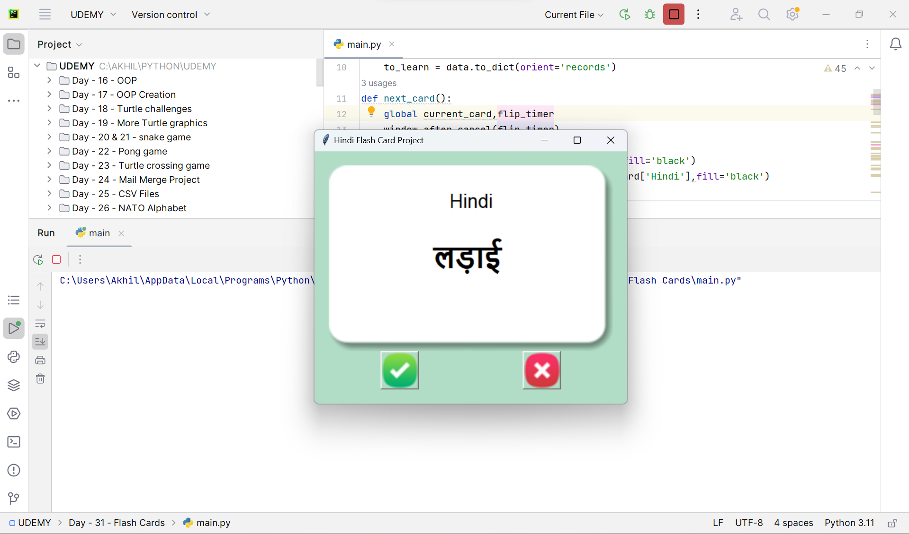
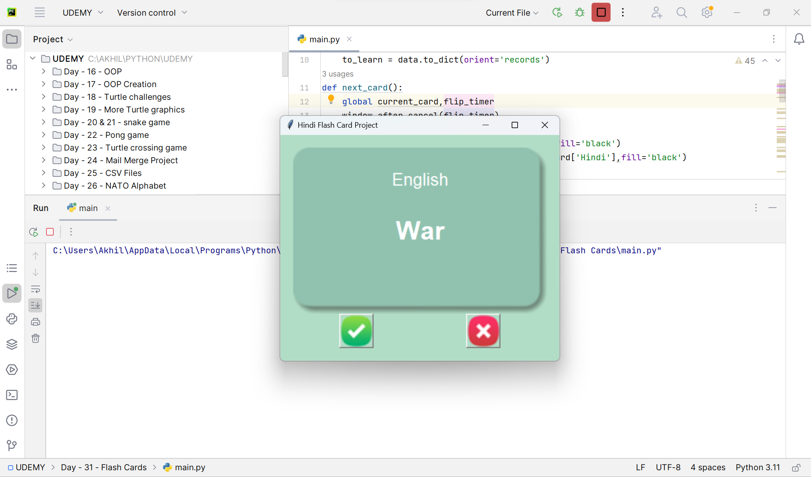

# Flashcard Language Practice

This repository contains a flashcard-based application designed to help users practice different aspects of a language, such as vocabulary, grammar, and pronunciation. The current version is implemented in Python using the Tkinter library to create a graphical user interface (GUI).

## Features
- Flashcards that display words in the chosen language (in this case: Hindi).
- Automatic card flip after 3 seconds to reveal the English translation.
- Simple and intuitive GUI for smooth user interaction.
- Procedural programming approach, making the project beginner-friendly.

## Requirements
To run this project, ensure you have the following installed:
- Python 3.x
- Tkinter (usually included with Python)

## Installation
1. Clone this repository:
   ```bash
   git clone https://github.com/your-username/flashcard-language-practice.git
   ```
2. Navigate to the project directory:
   ```bash
   cd flashcard-language-practice
   ```
3. Run the application:
   ```bash
   python flashcard.py
   ```

## How It Works
1. Launch the application to start practicing.
2. Each flashcard displays a word in Hindi (or the chosen language) on the front.
3. After 3 seconds, the card automatically flips to reveal the English translation.

Here’s a screenshot of the application in action:






## Future Enhancements
Potential improvements for this project include:
- Adding support for multiple languages.
- Customizable time intervals for card flipping.
- The ability to import and export custom word lists.
- Tracking user progress and performance.

---
Feel free to reach out with suggestions or questions!

